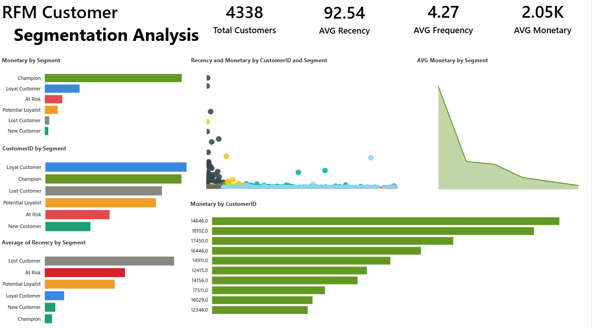

# RFM Customer Segmentation Analysis

## Project Overview
Performed RFM (Recency, Frequency, Monetary) customer segmentation on a real UK 
e-commerce dataset with 541,909 transactional records. Segmented 4,338 customers 
into 6 behavioural groups to identify high-value customers and at-risk segments.

## Key Findings
- **Champion customers (22%)** drive **64% of total revenue (£5.8M)**
- **454 At-Risk customers** averaging £1,634 spend flagged for retention targeting
- **824 Lost Customers** identified with lowest avg spend of £230
- **998 Loyal Customers** forming the second largest segment

## Tools Used
- **Python** — Pandas, NumPy (data cleaning)
- **SQL Server** — RFM calculation and business queries
- **Power BI** — Interactive dashboard (7 visuals)
- **Excel** — Initial data exploration

## Dataset
- Source: UCI Online Retail Dataset (Kaggle)
- Raw records: 541,909
- After cleaning: ~397,000
- Customers analysed: 4,338

## Project Steps
1. Data cleaning in Python — removed nulls, cancellations, negative values
2. Created Revenue column (Quantity × UnitPrice)
3. Calculated RFM scores using SQL Server
4. Scored customers 1–5 on each RFM dimension
5. Labelled 6 customer segments
6. Built Power BI dashboard with 7 visuals

## Dashboard Preview

## Business Recommendations
- Target 454 At-Risk customers with re-engagement campaigns
- Reward 962 Champions with loyalty programs
- Investigate 824 Lost Customers for churn reasons
- Nurture 781 Potential Loyalists to convert to Loyal segment

## File Structure
RFM-Customer-Segmentation/
│
├── OnlineRetail_Cleaned.csv
├── RFM_Segments_Fixed.csv
├── RFM_Country.csv
├── RFM_Analysis.pbix
├── rfm_notebook.ipynb
└── README.md
